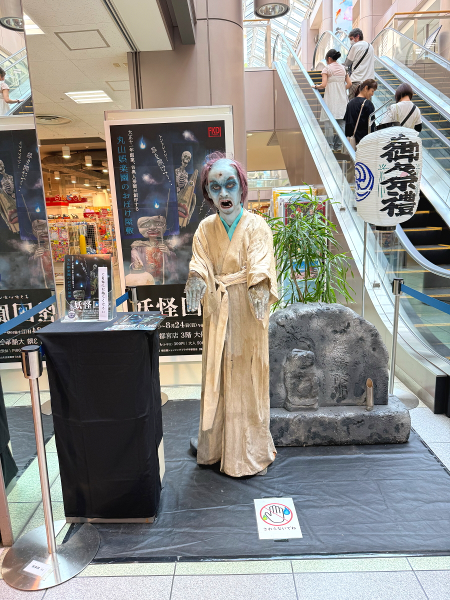
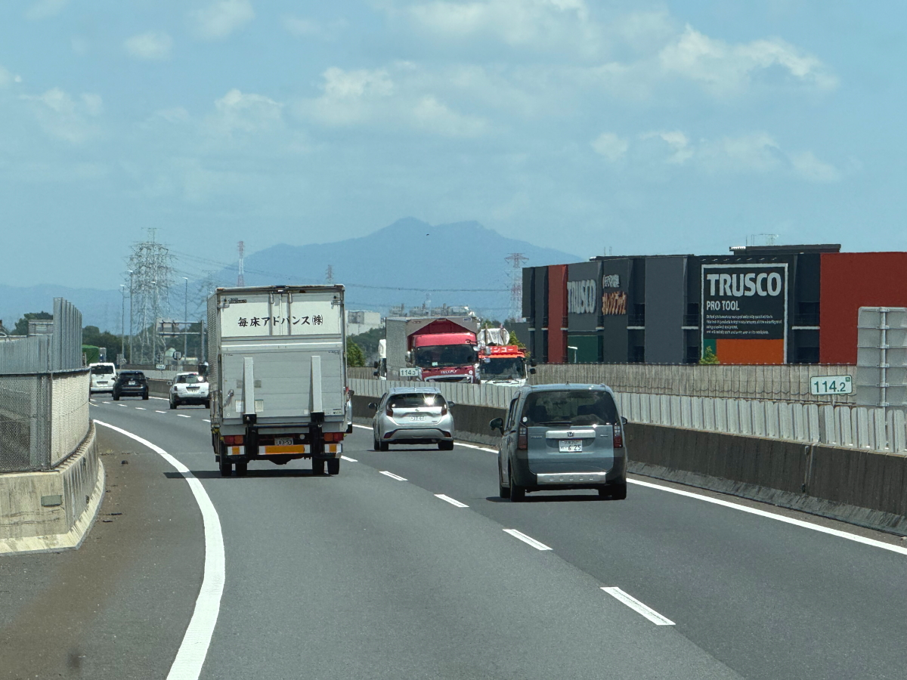
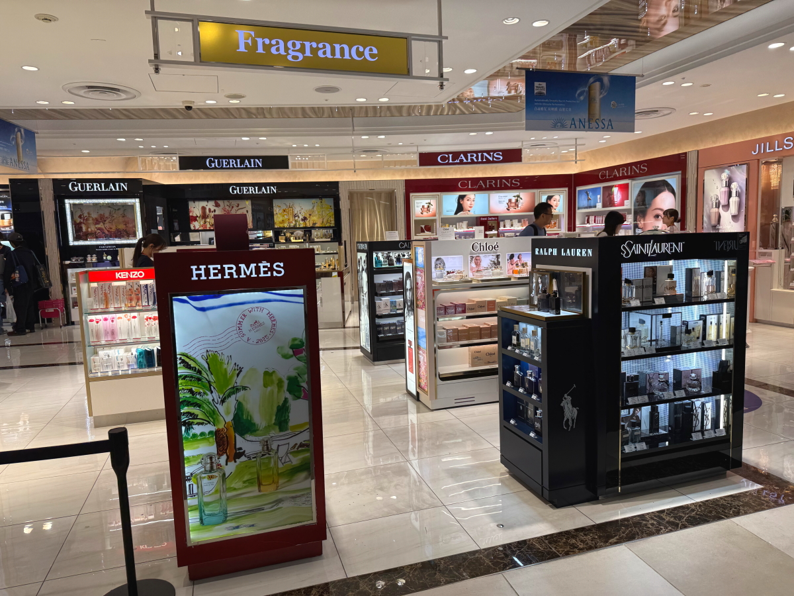

# 20250801_bangkok

<html lang="ja" data-loaded="false" data-scrolled="false" data-spmenu="closed">
<head>

<meta charset="UTF-8">
<meta http-equiv="Content-Type" content="text/html; charset=UTF-8">
<meta http-equiv="X-UA-Compatible" content="IE=EmulateIE10" />
<meta http-equiv="X-UA-Compatible" content="IE=edge">

<meta name="viewport" content="width=device-width, initial-scale=1.0">

<!--ここから上はお決まりの定型文です-->

<!--ここからが表現の書式などを決めるcssという部分-->

<link href="https://cdnjs.cloudflare.com/ajax/libs/lightbox2/2.7.1/css/lightbox.css" rel="stylesheet">

</head>

<body>

モバイル端末をお使いの場合は、画面を横向きにすると
より見やすくご覧頂けます。

<!--ここ上は、ほぼそのまま使います！-->

<!--QRコードの挿入例-->

 アクセス用QRコード

<marquee direction="left" scrollamount="20" width="30%">(^_^)/~alis</marquee>

<!--流れ文字の挿入例-->
<h1><marquee behavior="left">!!! 2025/07/29-31、いつものショッピングモールから飛行機から見たバンコクの夜景まで !!!</marquee></h1>

                          

<!--ここから下が、本体部分-->
    

 
<h2>29日はいつものショッピングモールで平和な時間 PC画面はHPのちょっとした修正作業</h2>

    
<h2>畦道から見えた西の空に天使のハシゴ</h2>

    
<h2>スーパーのお花達も皆ニッコリ</h2>

    
<h2>30日はお散歩コースのお花に朝日が当たってこんにちは！</h2>

<h2>車は娘夫婦に託すので、無線のアンテナははずします</h2>

    
<h2>無線機本体も下ろしました</h2>

    
<h2>リア周りの見た目が普通の車になりました</h2>

    
<h2>タイに持ち込む無線機セットの作動確認 海外で電波を出すには現地の電波管理局に申請が必要ですが、現代の技術では簡単なPCソフトで電波出さずにインターネット経由で世界中と交信できます 左側の小さな箱がソフトが入ったCLIP PC</h2>

    
<h2>写真の見た目が雑なので、AIに頼んでアニメ風の絵を生成してもらいました</h2>

    
<h2>日本の食事はしばらく食べないので、FKD前の大戸屋で鳥と野菜の黒酢あん定食</h2>

    
<h2>FKDは夏の怪談モード</h2>

    
    
<h2>バイクもしばらく乗れないので、ちょっとエンジンかけて水温が軽く温まる程度の暖気、その後Batt外します 画像クリックで動画再生します↓</h2>

    
<h2>Battのマイナス端子外して、かなり早めの冬眠モード</h2>

    
<h2>スーパーのお花たちもしばらく見納め</h2>

    
<h2>31日は朝日を浴びてお花たちがこんにちは</h2>

<h2>小さな公園では鶯がさえずりました</h2>

<iframe width="560" height="315" src="https://www.youtube.com/embed/q9XaP_CcRJE?si=VVXYlHqVW5DqseHQ" title="YouTube video player" frameborder="0" allow="accelerometer; autoplay; clipboard-write; encrypted-media; gyroscope; picture-in-picture; web-share" referrerpolicy="strict-origin-when-cross-origin" allowfullscreen></iframe>

    
<h2>お墓の向こうにはアマチュア無線のアンテナ、このサイズだと世界と交信できますね</h2>

    
<h2>庭のブルーベリーがもうすぐ実ります</h2>

    
<h2>もうセミの季節ですね〜宇都宮駅西口の街路樹</h2>

    
<h2>西口のマロニエバス乗り場の前に新しいビルが建設中 これから成田まで行って夕方の便でバンコクに飛びます</h2>

    
<h2>東北道で佐野の山々を抜けて南下します</h2>

    
<h2>田んぼの水不足が心配ですね</h2>

    
<h2>正面には筑波山</h2>

    
<h2>利根川越しに筑波山を臨みました</h2>

    
<h2>圏央道、五霞を超えたあたりで一度、利根川を渡ります</h2>

    
<h2>筑波山も大きく見えました</h2>

    
<h2>しばらくすると牛久大仏様が見え始めます</h2>

    
<h2>高速から見えるのは斜め後ろ姿のみ、ここが最大でした</h2>

    
<h2>成田に近づくともう一度、利根川を超えて千葉県に入ります</h2>

    
<h2>いよいよ成田空港の文字が見え始めます</h2>

    
<h2>今回は第２ターミナルからJALの機体に乗ります</h2>

    
<h2>スマホに入るアマチュア無線のアプリで移動経路が記録できます</h2>

    
<h2>手荷物検査も入念！</h2>

    
<h2>63番ゲートからの乗機でした</h2>

    
<h2>今回の便は5つの会社のコードシェア便</h2>

    
<h2>ゲートに向かう通路には高級化粧品のお店などが並びます</h2>

    
<h2>2時間以上前についたので、待合室はガラガラ</h2>

    
<h2>左端が今回乗る機体、お空には着陸する飛行機</h2>

    
<h2>22番席、右の窓から見える夕焼け空が綺麗 18:53</h2>

    
<h2>滑走路上でバードストライク発生、破片の掃除と滑走路点検の影響で離陸待ち 19:28</h2>

    
<h2>やっと離陸して機内食をいただきました 20:49</h2>

   
<h2>今回はこのメニューから左側の和食です</h2>

    
<h2>現地時間 10:54、5時間強の飛行でバンコクの上空に到達</h2>

    
<h2>人口約600万人の街、西の空にお月様が見えました 20:49</h2>

    
<h2>タクシーは行き先を告げると、スマホ地図を頼りに運転してました</h2>

<h2>スマホアプリでバンコクまでの経路も記録、機上では不作動でした</h2>

         

  
<h2>再掲【暑中お見舞い（ほたる）】LINEでご挨拶・動画で送る夏のグリーティングカード / ギターbgm/蛍の光・癒し動画</h2>

<iframe width="560" height="315" src="https://www.youtube.com/embed/Z4PKDOhRzfI?si=LaAJ8dA-1izGspEO" title="YouTube video player" frameborder="0" allow="accelerometer; autoplay; clipboard-write; encrypted-media; gyroscope; picture-in-picture; web-share" referrerpolicy="strict-origin-when-cross-origin" allowfullscreen></iframe>
    
   
    
    
    

  
<h2>今日のBGMはタイらしく กำจัดพลังงานเชิงลบทั้งหมดเสียงการรักษาทิเบตเพิ่มความแข็งแรงทางจิตใจ #4</h2>

<iframe width="560" height="315" src="https://www.youtube.com/embed/MqYf0vhuvEY?si=fIZxzhwsrwyDJZaz" title="YouTube video player" frameborder="0" allow="accelerometer; autoplay; clipboard-write; encrypted-media; gyroscope; picture-in-picture; web-share" referrerpolicy="strict-origin-when-cross-origin" allowfullscreen></iframe>
    

    
  
<h2>もう一つ、7月11日にメタバースで披露されたまいてゃさんの新曲 ちょっと音量小さめなのでボリュームあげて下さい</h2>

<iframe src="https://www.youtube.com/embed/K3CuXhdeKlY?si=yPW9XjXo5Hi18oeY" title="YouTube video player" frameborder="0" allow="accelerometer; autoplay; clipboard-write; encrypted-media; gyroscope; picture-in-picture; web-share" referrerpolicy="strict-origin-when-cross-origin" allowfullscreen></iframe>
    

    
    

    
    
    <h3>「雪の中で輝くシンデレラ」by まいてゃ</h3>
<h2><a href="https://torokoid.github.io/20250219_chiangrai/maitiyaz.mp3" target="_blank">この文字クリックで再生します 下の再生ボタンでも同じ曲をループ再生します</a></h2>

    <audio controls loop>
        <source src="https://torokoid.github.io/20250219_chiangrai/maitiyaz.mp3" type="audio/mpeg">
        お使いのブラウザは audio タグをサポートしていません。
    </audio>
 
    
<!--
  
<h2>スティーブ・ジョブズの伝説の講義</h2> 
<iframe width="560" height="315" src="https://www.youtube.com/embed/XsRpvWHIVw0?si=f7IA0pv9iZWVk3VH" title="YouTube video player" frameborder="0" allow="accelerometer; autoplay; clipboard-write; encrypted-media; gyroscope; picture-in-picture; web-share" referrerpolicy="strict-origin-when-cross-origin" allowfullscreen></iframe>    
    
    
<h2>スティーブ・ジョブズ氏の講義の内容が「笑って死ぬ」by まいてゃ さんの歌の内容と大筋で同じに聞こえます 以下に再掲しますね</h2>

    
<h3>歌の後半部分しか撮れてませんが、2月16日のイベントで公開された「笑って死ぬ」 by まいてゃ 白ドレスはダンサーの玖遠さん、黒いドレスがまいてゃさん</h3>
<iframe width="560" height="315" src="https://www.youtube.com/embed/s4ZcbxAluMM?si=Xa32xo19UCNaWv0v" title="YouTube video player" frameborder="0" allow="accelerometer; autoplay; clipboard-write; encrypted-media; gyroscope; picture-in-picture; web-share" referrerpolicy="strict-origin-when-cross-origin" allowfullscreen></iframe> 
-->
    

    <h3>お気に入りの「笑って死ぬ」 by まいてゃさんも再々掲です</h3>
<h2><a href="https://torokoid.github.io/20250221_chiangrai/maitiya3.mp3" target="_blank">この文字クリックで再生します 下の再生ボタンで同じ曲をループ再生します</a></h2>

    <audio controls loop>
        <source src="https://torokoid.github.io/20250221_chiangrai/maitiya3.mp3" type="audio/mpeg">
        お使いのブラウザは audio タグをサポートしていません。
    </audio>

   
<h2>以上、いつものショッピングモールから、バンコクの空からの夜景まででした。。 ここまでご覧いただきありがとうございました。</h2>

     
<h2>
<a href="https://torokoid.github.io/Mashiko_himawari_3/" target="_blank">クリックでメニューページに戻ります</a>
</h2>

   

         

  

      

<!--本体はここまで-->

<!--画面に空白地帯を作って、背景が見えるようにしています-->
                                              

<!-- フッタ -->
<footer>

Copyright 2025/08/01 alis @Bangkok

</footer>

<!--HPにさまざまなJavaScriptを呼び込むための書式-->

    
    </body>
    
</html>
